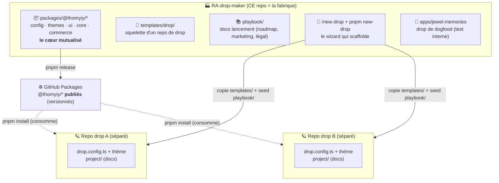
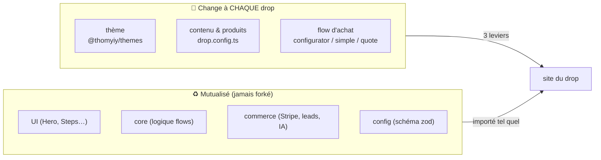

# Schéma — comment marche RA-drop-maker

## 1. Le principe : une fabrique → des drops



## 2. Ce qui change vs ce qui est mutualisé



## 3. Le flux de bout en bout

```
   TOI                FABRIQUE                    REGISTRE            DROP (repo séparé)
    │                    │                           │                      │
    │ pnpm release ─────►│  publie @thomyiy/* ──────►│ (versions figées)    │
    │                    │                           │                      │
    │ /new-drop ────────►│  copie templates/         │                      │
    │  "mon-drop"        │  + seed playbook/ ────────┼─────────────────────►│ repo créé
    │                    │                           │                      │
    │ remplir ───────────────────────────────────────────────────────────►│ drop.config.ts
    │  config + thème    │                           │                      │ + thème
    │                    │                           │                      │
    │ pnpm install ──────────────────────────────────┤ tire @thomyiy/* ────►│ build ✅
    │ pnpm build         │                           │                      │
    │                    │                           │                      ▼
    │                    │                           │                  🚀 Railway
```

**À retenir :** la fabrique **produit** (publie les libs + scaffolde) ; chaque drop **consomme**
les libs publiées et n'a que SON spécifique (thème + config + flow). Le cœur ne se duplique jamais.
